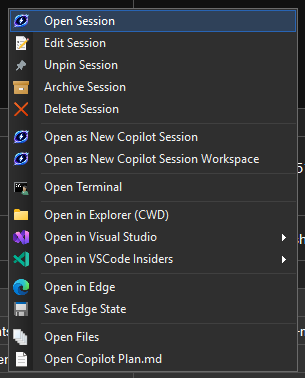
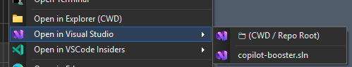
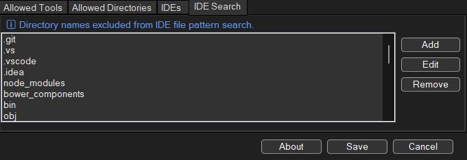

# Copilot Booster

<p align="center">
  
</p>

> Run multiple Copilot agents in parallel. One taskbar icon to manage them all.

Modern AI-assisted development isn't one task at a time — it's **multiple Copilot agents running simultaneously** across different repos, branches, and contexts. But juggling terminals, IDEs, and browsers for each agent creates a context-switching tax that kills the productivity gains.

**Copilot Booster** eliminates that overhead. Pin it to your taskbar and get **complete isolation per session** — each Copilot agent gets its own terminal, IDE workspace, and browser instance, all tracked and instantly accessible from a single icon. No more hunting for the right window. No more losing context. Just click and focus.

<p align="center">
  <a href="../../releases/latest"></a>
</p>

<p align="center">
  <a href="../../releases/latest/download/CopilotBooster-Setup.exe">📦 <b>Download Installer</b></a> &nbsp;|&nbsp;
  <a href="../../releases/latest/download/CopilotBooster-win-x64.zip">📁 <b>Download Portable ZIP</b></a>
</p>

### Why Copilot Booster?

| Without Copilot Booster | With Copilot Booster |
|---|---|
| Alt-Tab through dozens of windows to find the right terminal | Click the session → focus the exact terminal, IDE, or browser |
| Manually track which agent is working on what | Live Running column shows Terminal, Copilot CLI, IDE, Edge, and Explorer status per session |
| One shared browser for all research | Isolated Edge workspaces per session — tabs saved and restored automatically |
| Context-switch between repos by cd-ing around | Git worktree workspaces give each agent its own branch and directory |
| Lose track of parallel agents after a restart | Window handles, terminals, and Edge tabs all persist across restarts |
| No idea when an agent finishes | 🔔 Bell notifications with toast popups when a session is ready |

---

## ✨ Features at a Glance

### 📌 Taskbar Jump List

Right-click the pinned icon to access everything:

<p align="center">
  
</p>

- **New Copilot Session** — start a new session with a smart directory picker
- **Existing Sessions** — browse, resume, or open sessions in your IDE
- **Settings** — configure tools, directories, and IDEs

---

### 🔄 Session Browser & Active Context Tracking

The session browser is the central hub. Each session shows **Session**, **CWD** (with ⎇ for Git repos), **Date**, and **Running** columns — giving you a live view of what's running where. Sessions with active processes are automatically sorted to the top.

<p align="center">
  
</p>

The **Running** column tracks running contexts across multiple environments:

| Context | How it's detected |
|---------|-------------------|
| **Terminal** | Windows launched via "Open Terminal" are tracked by PID and cached across restarts |
| **Copilot CLI** | Detected via `events.jsonl` content parsing — working (spinner) or idle (bell) |
| **IDE** | IDEs launched via the Open menu are tracked by window handle and cached across restarts |
| **Edge** | Browser workspaces tracked via UI Automation anchor-tab detection |
| **Explorer** | Explorer windows opened via context menu are tracked by HWND |
| **Files** | Session files folder opened via context menu |

Each active context is a **clickable link** — click to focus the corresponding window instantly. Re-opening an IDE that's already tracked for a session will focus the existing window instead of launching a new instance.

<p align="center">
  
</p>

Other session browser features:
- **Multi-select** — hold Ctrl for individual selection or Shift for range selection; batch Pin/Unpin and Archive/Unarchive via context menu
- **Search** — filter sessions by title, folder, or metadata as you type
- **Active/Archived tabs** — archive sessions to keep your active list clean; unarchive anytime
- **Pinned sessions** — pin sessions to keep them at the top regardless of sorting
- **Auto-refresh** — the list updates when new sessions appear or names change externally
- **Auto-cleanup** — empty sessions with no activity are automatically removed

---

### 🔔 Session Status & Toast Notifications

The status column shows live session state with animated icons — a **spinning blue indicator** when Copilot CLI is working, and a **🔔 red bell** when it's idle and waiting for input. Bell rows are highlighted with a prominent red background for quick visual scanning.

<p align="center">
  
</p>

When a session finishes work, a **Windows toast notification** pops up with the session name. Status detection is powered by content-based parsing of `events.jsonl` — it understands assistant turns, tool requests, and `ask_user` pauses.

<p align="center">
  
</p>

- **Content-based detection** — parses event types (assistant.turn_start, tool.execution_start, ask_user) for accurate status
- **One-shot notifications** — each bell only fires once per idle transition
- **Staleness threshold** — sessions inactive for 30+ minutes are ignored to prevent false bells
- **Startup-aware** — existing idle sessions don't trigger false notifications when the app launches
- **Persistent bell state** — bell notifications survive app restarts
- **Configurable** — toggle notifications on/off in Settings

---

### 📋 Right-Click Context Menu

Right-click any session row to access all actions in a single context menu with system icons:

<p align="center">
  
</p>

| Action | Description |
|--------|-------------|
| **Open Session** | Resume the session in its original working directory |
| **Edit Session** | Rename the session or change its working directory |
| **Pin / Unpin** | Pin sessions to keep them at the top of the list |
| **Archive / Unarchive** | Move sessions to the Archived tab |
| **Delete Session** | Soft-delete a session (instantly removed from the list) |
| **Open as New Copilot Session** | Start a fresh Copilot CLI session in the same directory |
| **Open as New Copilot Session Workspace** | Create a Git worktree workspace (Git repos only) |
| **Open Terminal** | Launch a terminal via Windows Terminal (wt.exe) |
| **Open in Explorer (CWD)** | Open the working directory in Explorer |
| **Open in {IDE}** | Sub-menu with CWD/Repo Root folders + matched project files |
| **Open in Edge** | Launch a managed Edge browser workspace |
| **Save Edge State** | Manually save Edge tabs (visible when Edge is open) |
| **Open Files** | Open the session's files folder |
| **Open Copilot Plan.md** | Open the session's plan file (if it exists) |

---

### 🔍 IDE File Pattern Matching

Configure file patterns per IDE (e.g., `*.sln;*.slnx`) in Settings. When a pattern is set, the IDE context menu becomes a **sub-menu** that searches for matching project files and shows them for quick one-click opening.

<p align="center">
  
</p>

- **Fast search** — uses `git ls-files` for Git repos (respects .gitignore), falls back to directory walk with configurable ignored directories
- **Depth-sorted** — shallowest matches shown first, up to 5 results
- **Configurable exclusions** — manage ignored directories (node_modules, bin, obj, etc.) in the "IDE Search" settings tab

<p align="center">
  
</p>

---

### 🌐 Edge Browser Workspaces

Open a managed Microsoft Edge window linked to any session. Each workspace gets a unique anchor tab that lets Copilot Booster track, focus, and detect whether the browser window is still open.

<p align="center">
  
</p>

- **Tab save/restore** — save Edge tabs via "Save Edge State" in the context menu; tabs are restored when reopening Edge for the session
- **Active tracking** — the Edge workspace appears as a clickable link in the Running column
- **Session name in tab** — the anchor tab title shows the session name; updates live when you change the alias
- **Manual save** — "Save Edge State" context menu button saves all open tabs for the session
- **Tab-level detection** — uses UI Automation to find the anchor tab across all Edge windows
- **Auto-cleanup** — when you close the anchor tab or the Edge window, the workspace is automatically removed from tracking

---

### 📂 Smart Directory Picker

The **New Session** dialog shows your most-used working directories — sorted by frequency across all previous sessions. Non-existent paths are automatically cleaned up.

<p align="center">
  
</p>

Each directory shows:
- **# Sessions created** — how many sessions have used this path
- **Git** — whether the directory is inside a Git repository (including worktrees)

Right-click any directory to access all actions, or double-click to quickly start a new session with a name prompt.

---

### 🌿 Git Workspace Creation

For Git-enabled directories, Copilot Booster can create isolated workspaces backed by [git worktrees](https://git-scm.com/docs/git-worktree). Each workspace gets its own branch and directory — perfect for working on multiple features in parallel without stashing or switching branches.

Create a workspace from two places:
- **New Session** → right-click a Git directory → **New Copilot Session Workspace**
- **Existing Sessions** → right-click a session → **Open as New Copilot Session Workspace**

Workspaces are stored in `%APPDATA%\CopilotBooster\Workspaces\` and named after the repository and branch (e.g., `myrepo-feature-xyz`).

---

### ⚙️ Settings

All configuration lives in a tabbed UI with info labels and tooltips — no JSON editing required.

<p align="center">
  
</p>

- **Theme** — choose between System (default), Light, or Dark theme; persisted across restarts
- **Notify on bell** — toggle Windows toast notifications when sessions finish work
- **Always on top** — keep the window above other windows
- **Auto-hide on focus** — hide other session windows when focusing one
- **Max active sessions** — configurable limit (0 = unlimited)
- **Pinned order** — sort pinned sessions by last updated or alias name
- **Allowed Tools** — whitelist shell commands and MCP tools that Copilot can use without prompting
- **Allowed Directories** — grant Copilot access to specific directories
- **IDEs** — register your IDEs with optional file patterns (e.g., `*.sln;*.slnx`) for project file search
- **IDE Search** — manage directories excluded from IDE file pattern search
- **Default Work Dir** — set the default working directory for new sessions

---

### 🔄 In-App Updates

Copilot Booster checks for new versions on startup via the GitHub Releases API. When an update is available, a banner appears at the bottom of the window — click to download and install the latest version automatically.

---

### 🔔 System Tray

Copilot Booster lives in your system tray for instant access. Closing the window minimizes to tray instead of exiting — only **Quit** from the tray menu exits the application.

<p align="center">
  
</p>

- **Double-click** the tray icon to show/restore the window
- **Right-click** for quick access to Show, Settings, or Quit
- The tray icon is always visible while the app is running

---

## 🚀 Getting Started

### Prerequisites

- [.NET 10 Runtime](https://dotnet.microsoft.com/download/dotnet/10.0) (or SDK for building from source)
- [GitHub Copilot CLI](https://docs.github.com/en/copilot/github-copilot-in-the-cli) — install via `winget install GitHub.Copilot` or `GitHub.Copilot.Prerelease`

### Install

#### Option A: Installer (Recommended)

Download **`CopilotBooster-Setup.exe`** from the [latest release](../../releases/latest) and run it.

- Installs to `%APPDATA%\CopilotBooster\` — no admin required
- Creates Start Menu and optional desktop shortcuts
- Includes uninstaller (Add/Remove Programs)

#### Option B: Portable EXE

Download **`CopilotBooster-win-x64.zip`** from the [latest release](../../releases/latest), extract it anywhere, and run `CopilotBooster.exe`.

#### Option C: Build from Source

```powershell
git clone <repo-url> copilot-booster
cd copilot-booster
.\install.ps1
```

### Pin to Taskbar

1. Run `CopilotBooster.exe` from the publish folder
2. Right-click the icon in the taskbar → **Pin to taskbar**
3. Right-click the pinned icon → **Settings** to configure your tools and directories

### Manual Build

```powershell
cd src
dotnet publish -c Release -o ..\publish
```

### Build Installer (requires [Inno Setup](https://jrsoftware.org/isdownload.php))

```powershell
dotnet publish src/CopilotBooster.csproj -c Release -o publish
iscc installer.iss
# Output: installer-output\CopilotBooster-Setup.exe
```

---

## 💻 Command Line

```powershell
CopilotBooster.exe                        # Open New Session tab
CopilotBooster.exe "C:\my\project"        # New session in a specific directory
CopilotBooster.exe --resume <sessionId>   # Resume a session in its original CWD
CopilotBooster.exe --open-existing        # Open the session browser
CopilotBooster.exe --open-ide <sessionId> # Open IDE picker for a session
CopilotBooster.exe --settings             # Open settings
```

---

## 🏗️ Architecture

```
CopilotBooster.exe (WinForms .NET 10, persistent taskbar window)
├── System tray icon (always visible, minimize-to-tray on close)
├── Sets AppUserModelID for taskbar/JumpList/toast association
├── Registers PID → session mapping in %APPDATA%\CopilotBooster\active-pids.json
├── Launches copilot.exe with --allow-tool and --add-dir from settings
├── Creates session workspace.yaml + events.jsonl for new sessions
├── Active context tracking (Terminal, Copilot CLI, IDE, Edge, Explorer)
│   ├── PID registry + process scanning for terminals
│   ├── events.jsonl content parsing for Copilot CLI status (working/idle/bell)
│   ├── HWND tracking for IDE instances (persisted across restarts)
│   ├── UI Automation for Edge anchor-tab detection
│   └── HWND tracking for Explorer windows
├── Per-session state (Edge tabs, session-specific data)
├── IDE file pattern search (git ls-files / directory walk)
├── Window handle cache persistence (unified for all window types)
├── Terminal cache persistence across restarts
├── Updates jump list on launch + every 5 min (background, coordinated)
└── Cleans up on exit (unregisters PID, refreshes jump list)
```

### Key Services

| Service | Purpose |
|---------|---------|
| `ActiveStatusTracker` | Aggregates active status across all context types with HWND persistence |
| `EventsJournalService` | Content-based Copilot CLI status detection via events.jsonl parsing |
| `BellNotificationService` | Toast notifications and bell state management |
| `SessionDataService` | Unified session loading with Git detection caching |
| `CopilotSessionCreatorService` | Creates new sessions with workspace.yaml and events.jsonl |
| `EdgeWorkspaceService` | Edge browser workspace lifecycle and UI Automation |
| `EdgeTabPersistenceService` | Save/restore Edge tabs per session |
| `IdeFileSearchService` | Fast project file search (git ls-files / directory walk) |
| `SessionStateService` | Per-session state directory management |
| `WindowHandleCacheService` | Unified window handle persistence across restarts |
| `TerminalCacheService` | Persists terminal sessions across app restarts |
| `WindowFocusService` | HWND-based window focusing with P/Invoke |
| `SessionService` | Session CRUD, search, and Git root detection |
| `SessionArchiveService` | Archive and pin state persistence |
| `CopilotLocator` | Finds the Copilot CLI executable |

### Files

| Path | Purpose |
|------|---------|
| `%APPDATA%\CopilotBooster\launcher-settings.json` | Tools, directories, IDEs, file patterns, ignored dirs |
| `%APPDATA%\CopilotBooster\active-pids.json` | PID → session ID mapping |
| `%APPDATA%\CopilotBooster\terminal-cache.json` | Cached terminal sessions for restart persistence |
| `%APPDATA%\CopilotBooster\window-handles.json` | Unified window handle cache (IDE, Explorer, Edge) |
| `%APPDATA%\CopilotBooster\session-states.json` | Archive and pin states per session |
| `%APPDATA%\CopilotBooster\sessions\{id}\` | Per-session state directory |
| `%APPDATA%\CopilotBooster\sessions\{id}\edge-tabs.json` | Saved Edge tab URLs |
| `%APPDATA%\CopilotBooster\jumplist-lastupdate.txt` | Update coordination timestamp |
| `%APPDATA%\CopilotBooster\launcher.log` | Debug log |
| `%APPDATA%\CopilotBooster\pinned-directories.json` | Manually-added directories for New Session |
| `~/.copilot/session-state/` | Session metadata (managed by Copilot CLI) |

---

## 📄 License

MIT
