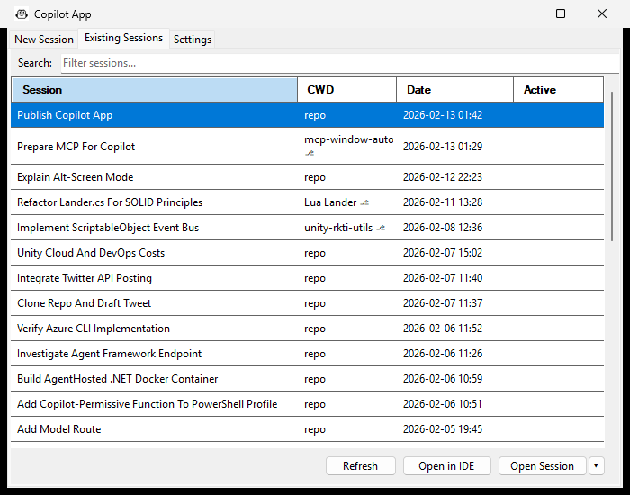
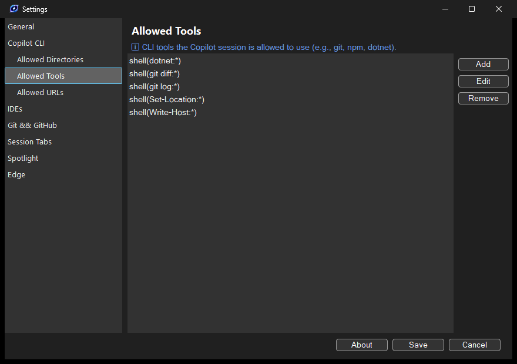
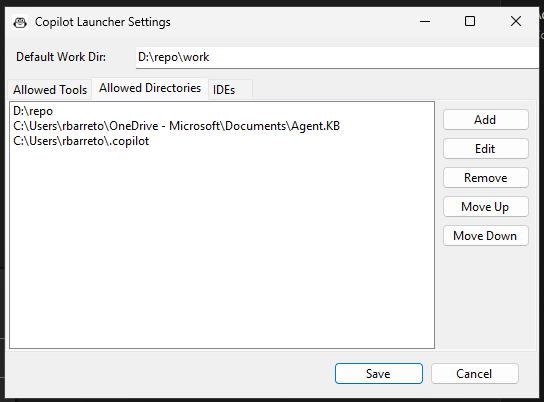
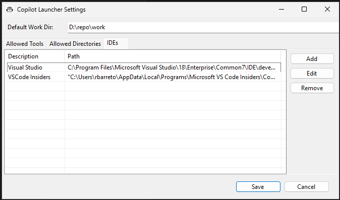

# Copilot App

> A Windows taskbar companion for GitHub Copilot CLI — manage sessions, tools, and IDEs from a single pinned icon.

**Copilot App** turns [GitHub Copilot CLI](https://docs.github.com/en/copilot/github-copilot-in-the-cli) into a first-class desktop experience. Pin it to your taskbar and get instant access to new sessions, session history, IDE integration, and per-user tool permissions — all without touching config files.

---

## ✨ Features at a Glance

### 📌 Taskbar Jump List

Right-click the pinned icon to access everything:

<p align="center">
  
</p>

- **New Copilot Session** — start a new session with a smart directory picker
- **Existing Sessions** — browse, resume, or open sessions in your IDE
- **Settings** — configure tools, directories, and IDEs

---

### 📂 Smart Directory Picker

When starting a new session, Copilot App shows your most-used working directories — sorted by frequency across all previous sessions. Non-existent paths are automatically cleaned up.

<p align="center">
  
</p>

Each directory shows:
- **# Sessions created** — how many sessions have used this path
- **Git** — whether the directory is inside a Git repository (including worktrees)

Click **Start** to launch a session, **Browse...** to pick any folder, or **Create Workspace** to create an isolated Git worktree for the selected directory.

---

### 🌿 Git Workspace Creation

For Git-enabled directories, Copilot App can create isolated workspaces backed by [git worktrees](https://git-scm.com/docs/git-worktree). Each workspace gets its own branch and directory — perfect for working on multiple features in parallel without stashing or switching branches.

Create a workspace from two places:
- **New Session tab** → select a Git directory → click **Create Workspace**
- **Existing Sessions tab** → select a session → **Open Session ▾** → **Open as New Session Workspace**

<p align="center">
  
</p>

Workspaces are stored in `%APPDATA%\CopilotApp\Workspaces\` and named after the repository and branch (e.g., `myrepo-feature-xyz`).

---

### 🔄 Session Browser

Resume any previous session with full context. The session list shows four columns:

- **Session** — the session summary/title
- **CWD** — the working directory folder name, with a ⎇ icon for Git-enabled sessions
- **Date** — when the session was last modified
- **Active** — clickable links showing running terminals and IDEs (highlighted in blue)

<p align="center">
  
</p>

- **Search** — filter sessions by title, folder, or metadata as you type
- **Active session tracking** — open terminals and IDEs are shown as clickable links; click to focus the window
- **Persistent window** — the app stays open after launching sessions so you can manage multiple at once
- **Auto-cleanup** — empty sessions with no activity are automatically removed
- **Open Session** — resumes the session in its original working directory
- **Open Session ▾** — dropdown with additional options:
  - **Open as New Session** — starts a fresh session in the same directory
  - **Open as New Session Workspace** — creates a Git worktree workspace (Git directories only)
- **Open in IDE** — jump straight into the code (see below)
- **Open in Edge** — launch a managed Edge browser workspace linked to the session (see below)
- **Refresh** — reload the session list without reopening the window
- **Edit session** — right-click any session row to rename it or change its working directory

---

### 🌐 Edge Browser Workspaces

Open a managed Microsoft Edge window linked to any session. Each workspace gets a unique anchor tab that lets Copilot App track, focus, and detect whether the browser window is still open.

- **Open in Edge** — launches a new Edge window with a session-linked anchor tab
- **Active tracking** — the Edge workspace appears as a clickable link in the Active column; click to focus the window
- **Tab-level detection** — uses UI Automation to find the anchor tab across all Edge windows, even when another tab is active
- **Auto-cleanup** — when you close the anchor tab or the Edge window, the workspace is automatically removed from tracking
- **Re-discovery** — if you restart Copilot App while an Edge workspace is still open, it will be re-detected on the next refresh

---

### 🖥️ IDE Integration

Open any session's working directory or git repository root in your configured IDE — with a single click.

<p align="center">
  
</p>

Each IDE shows two options:
- **Open CWD** — opens the session's exact working directory
- **Open Repo** — opens the git repository root (when different from CWD)

---

### ⚙️ Settings

All configuration lives in a tabbed UI — no JSON editing required.

#### Allowed Tools
Whitelist shell commands and MCP tools that Copilot can use without prompting:

<p align="center">
  
</p>

#### Allowed Directories
Grant Copilot access to specific directories:

<p align="center">
  
</p>

#### IDEs
Register your IDEs for the "Open in IDE" feature:

<p align="center">
  
</p>

---

### 🔄 In-App Updates

Copilot App checks for new versions on startup via the GitHub Releases API. When an update is available, a banner appears at the bottom of the window — click to download and install the latest version automatically.

---

## 🚀 Getting Started

### Prerequisites

- [.NET 10 Runtime](https://dotnet.microsoft.com/download/dotnet/10.0) (or SDK for building from source)
- [GitHub Copilot CLI](https://docs.github.com/en/copilot/github-copilot-in-the-cli) — install via `winget install GitHub.Copilot` or `GitHub.Copilot.Prerelease`

### Install

#### Option A: Installer (Recommended)

Download **`CopilotApp-Setup.exe`** from the [latest release](../../releases/latest) and run it.

- Installs to `%APPDATA%\CopilotApp\` — no admin required
- Creates Start Menu and optional desktop shortcuts
- Includes uninstaller (Add/Remove Programs)

#### Option B: Portable EXE

Download **`CopilotApp-win-x64.zip`** from the [latest release](../../releases/latest), extract it anywhere, and run `CopilotApp.exe`.

#### Option C: Build from Source

```powershell
git clone <repo-url> copilot-app
cd copilot-app
.\install.ps1
```

### Pin to Taskbar

1. Run `CopilotApp.exe` from the publish folder
2. Right-click the icon in the taskbar → **Pin to taskbar**
3. Right-click the pinned icon → **Settings** to configure your tools and directories

### Manual Build

```powershell
cd src
dotnet publish -c Release -o ..\publish
```

### Build Installer (requires [Inno Setup](https://jrsoftware.org/isdownload.php))

```powershell
dotnet publish src/CopilotApp.csproj -c Release -o publish
iscc installer.iss
# Output: installer-output\CopilotApp-Setup.exe
```

---

## 💻 Command Line

```powershell
CopilotApp.exe                        # New session (shows CWD picker)
CopilotApp.exe "C:\my\project"        # New session in a specific directory
CopilotApp.exe --resume <sessionId>   # Resume a session in its original CWD
CopilotApp.exe --open-existing        # Open the session browser
CopilotApp.exe --open-ide <sessionId> # Open IDE picker for a session
CopilotApp.exe --settings             # Open settings
```

---

## 🏗️ Architecture

```
CopilotApp.exe (WinForms, hidden taskbar window)
├── Sets AppUserModelID for taskbar grouping
├── Registers PID → session mapping in ~/.copilot/active-pids.json
├── Launches copilot.exe with --allow-tool and --add-dir from settings
├── Detects new session via directory snapshot (before/after launch)
├── Updates jump list on launch + every 5 min (background, coordinated)
└── Cleans up on exit (unregisters PID, refreshes jump list)
```

### Files

| Path | Purpose |
|------|---------|
| `~/.copilot/launcher-settings.json` | Tools, directories, IDEs, default work dir |
| `~/.copilot/active-pids.json` | PID → session ID mapping |
| `~/.copilot/jumplist-lastupdate.txt` | Update coordination timestamp |
| `~/.copilot/launcher.log` | Debug log |
| `~/.copilot/session-state/` | Session metadata (managed by Copilot CLI) |

---

## 📄 License

MIT
