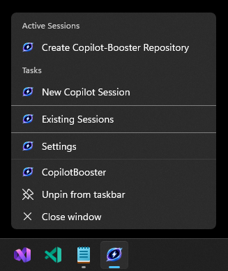
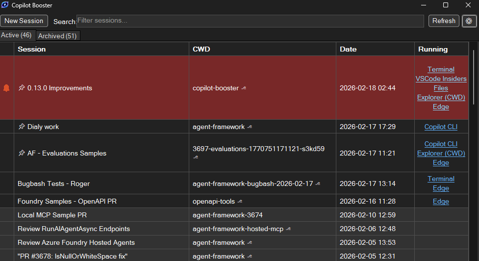
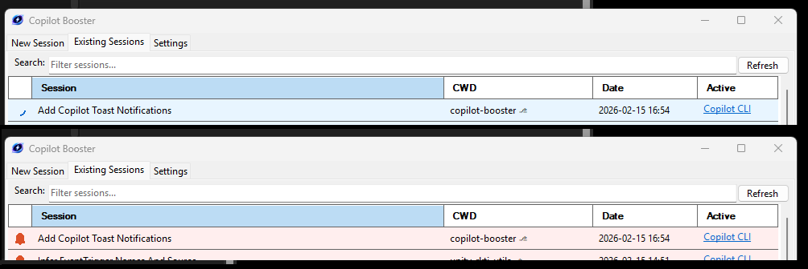
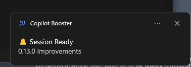
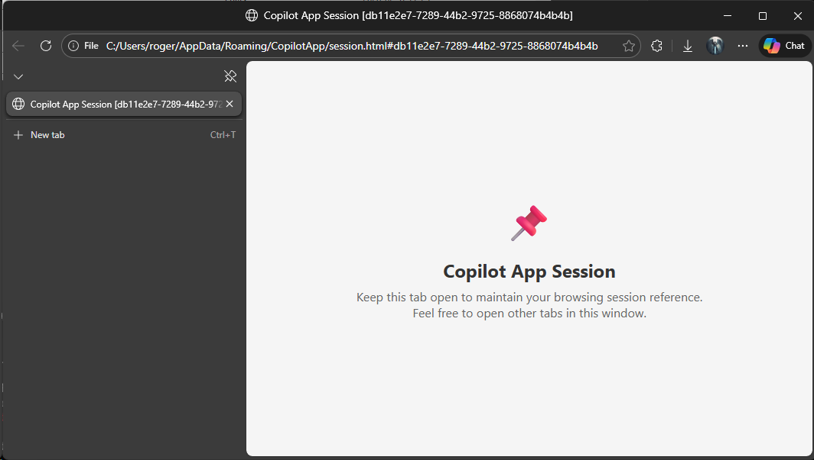
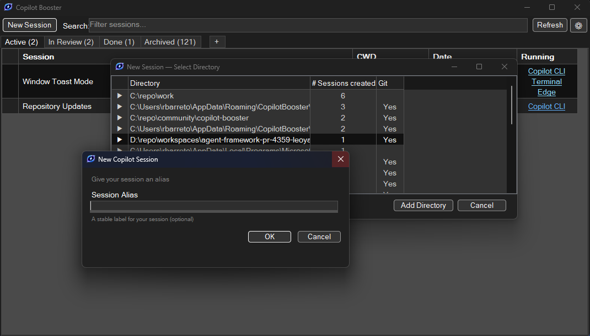
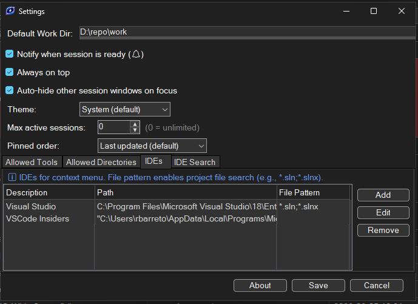
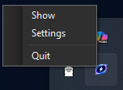

# Copilot Booster

<p align="center">
  
</p>

> Run multiple Copilot agents in parallel. One taskbar icon to manage them all.

Modern AI-assisted development isn't one task at a time — it's **multiple Copilot agents running simultaneously** across different repos, branches, and contexts. But juggling terminals, IDEs, and browsers for each agent creates a context-switching tax that kills the productivity gains.

**Copilot Booster** eliminates that overhead. Pin it to your taskbar and get **complete isolation per session** — each Copilot agent gets its own terminal, IDE workspace, and browser instance, all tracked and instantly accessible from a single icon. No more hunting for the right window. No more losing context. Just click and focus.

<p align="center">
  <a href="../../releases/latest"></a>
</p>

<p align="center">
  <a href="../../releases/latest/download/CopilotBooster-Setup.exe">📦 <b>Download Installer</b></a> &nbsp;|&nbsp;
  <a href="../../releases/latest/download/CopilotBooster-win-x64.zip">📁 <b>Download Portable ZIP</b></a>
</p>

### Why Copilot Booster?

| Without Copilot Booster | With Copilot Booster |
|---|---|
| Alt-Tab through dozens of windows to find the right terminal | Click the session → focus the exact terminal, IDE, or browser |
| Manually track which agent is working on what | Live Active column shows Terminal, Copilot CLI, IDE, and Edge status per session |
| One shared browser for all research | Isolated Edge workspaces per session — tabs don't bleed across tasks |
| Context-switch between repos by cd-ing around | Git worktree workspaces give each agent its own branch and directory |
| Lose track of parallel agents after a restart | Terminal and browser persistence survives app restarts |

---

## ✨ Features at a Glance

### 📌 Taskbar Jump List

Right-click the pinned icon to access everything:

<p align="center">
  
</p>

- **New Copilot Session** — start a new session with a smart directory picker
- **Existing Sessions** — browse, resume, or open sessions in your IDE
- **Settings** — configure tools, directories, and IDEs

---

### 🔄 Session Browser & Active Context Tracking

The Existing Sessions tab is the central hub. Each session shows five columns — **Status** (animated icons), **Session**, **CWD** (with ⎇ for Git repos), **Date**, and **Active** — giving you a live view of what's running where.

<p align="center">
  
</p>

The **Active** column tracks running contexts across multiple environments:

| Context | How it's detected |
|---------|-------------------|
| **Terminal** | Windows launched via "Open Terminal" are tracked by PID and cached across restarts |
| **Copilot CLI** | Open terminal windows are scanned by matching session summaries in window titles |
| **IDE** | IDEs launched via the Open menu are tracked by window handle and cached across restarts |
| **Edge** | Browser workspaces are tracked via UI Automation anchor-tab detection |

Each active context is a **clickable link** — click to focus the corresponding window instantly. Re-opening an IDE that's already tracked for a session will focus the existing window instead of launching a new instance.

<p align="center">
  
</p>

Other session browser features:
- **Search** — filter sessions by title, folder, or metadata as you type
- **Terminal persistence** — active terminals survive app restarts
- **Auto-refresh** — the list updates when new sessions appear or names change externally
- **Auto-cleanup** — empty sessions with no activity are automatically removed
- **Loading indicator** — shows "Loading sessions..." while session data is being fetched

---

### 🔔 Session Status & Toast Notifications

The **Status** column shows live session state with animated icons — a spinning blue indicator when Copilot CLI is working, and a red bell when it's idle and waiting for input. Bell rows are highlighted with a soft red background for quick visual scanning.

<p align="center">
  
</p>

When a session finishes work, a **Windows toast notification** pops up via the system tray icon with the session name. Click the notification to instantly focus the Copilot CLI terminal.

<p align="center">
  
</p>

- **One-shot notifications** — each bell only fires once per idle transition; clicking to focus a session suppresses the bell until the next work cycle completes
- **Startup-aware** — existing idle sessions don't trigger false notifications when the app launches
- **Configurable** — toggle notifications on/off in the Settings tab

---

### 📋 Right-Click Context Menu

Right-click any session row to access all actions in a single context menu:

<p align="center">
  
</p>

| Action | Description |
|--------|-------------|
| **Open Session** | Resume the session in its original working directory |
| **Edit Session** | Rename the session or change its working directory |
| **Open as New Copilot Session** | Start a fresh Copilot CLI session in the same directory |
| **Open as New Copilot Session Workspace** | Create a Git worktree workspace (Git repos only) |
| **Open Terminal** | Launch a standalone terminal in the session's directory |
| **Open in {IDE} (CWD)** | Open the working directory in your configured IDE |
| **Open in {IDE} (Repo Root)** | Open the Git repository root in your IDE |
| **Open in Edge** | Launch a managed Edge browser workspace |

IDE entries are added dynamically based on your configured IDEs in Settings.

---

### 🌐 Edge Browser Workspaces

Open a managed Microsoft Edge window linked to any session. Each workspace gets a unique anchor tab that lets Copilot Booster track, focus, and detect whether the browser window is still open.

<p align="center">
  
</p>

- **Active tracking** — the Edge workspace appears as a clickable link in the Active column; click to focus the window
- **Tab-level detection** — uses UI Automation to find the anchor tab across all Edge windows, even when another tab is active
- **Auto-cleanup** — when you close the anchor tab or the Edge window, the workspace is automatically removed from tracking
- **Re-discovery** — if you restart Copilot Booster while an Edge workspace is still open, it will be re-detected on the next refresh

---

### 📂 Smart Directory Picker

The **New Session** tab shows your most-used working directories — sorted by frequency across all previous sessions. Non-existent paths are automatically cleaned up.

<p align="center">
  
</p>

Each directory shows:
- **# Sessions created** — how many sessions have used this path
- **Git** — whether the directory is inside a Git repository (including worktrees)

Right-click any directory to access all actions, or double-click to quickly start a new session with a name prompt:

| Action | Description |
|--------|-------------|
| **New Copilot Session** | Create a named session in the selected directory |
| **New Copilot Session Workspace** | Create a Git worktree workspace (Git repos only) |
| **Add Directory** | Browse for a new directory to add to the list |
| **Remove Directory** | Remove a manually-added directory (pinned only) |

---

### 🌿 Git Workspace Creation

For Git-enabled directories, Copilot Booster can create isolated workspaces backed by [git worktrees](https://git-scm.com/docs/git-worktree). Each workspace gets its own branch and directory — perfect for working on multiple features in parallel without stashing or switching branches.

Create a workspace from two places:
- **New Session tab** → right-click a Git directory → **New Copilot Session Workspace**
- **Existing Sessions tab** → right-click a session → **Open as New Copilot Session Workspace**

Workspaces are stored in `%APPDATA%\CopilotBooster\Workspaces\` and named after the repository and branch (e.g., `myrepo-feature-xyz`).

---

### ⚙️ Settings

All configuration lives in a tabbed UI — no JSON editing required.

<p align="center">
  
</p>

- **Allowed Tools** — whitelist shell commands and MCP tools that Copilot can use without prompting
- **Allowed Directories** — grant Copilot access to specific directories
- **IDEs** — register your IDEs for the Open menu (e.g., Visual Studio, VS Code, Rider)
- **Default Work Dir** — set the default working directory for new sessions

---

### 🔄 In-App Updates

Copilot Booster checks for new versions on startup via the GitHub Releases API. When an update is available, a banner appears at the bottom of the window — click to download and install the latest version automatically.

---

### 🔔 System Tray

Copilot Booster lives in your system tray for instant access. Closing the window minimizes to tray instead of exiting — only **Quit** from the tray menu exits the application.

<p align="center">
  
</p>

- **Double-click** the tray icon to show/restore the window
- **Right-click** for quick access to Show, Settings, or Quit
- The tray icon is always visible while the app is running

---

## 🚀 Getting Started

### Prerequisites

- [.NET 10 Runtime](https://dotnet.microsoft.com/download/dotnet/10.0) (or SDK for building from source)
- [GitHub Copilot CLI](https://docs.github.com/en/copilot/github-copilot-in-the-cli) — install via `winget install GitHub.Copilot` or `GitHub.Copilot.Prerelease`

### Install

#### Option A: Installer (Recommended)

Download **`CopilotBooster-Setup.exe`** from the [latest release](../../releases/latest) and run it.

- Installs to `%APPDATA%\CopilotBooster\` — no admin required
- Creates Start Menu and optional desktop shortcuts
- Includes uninstaller (Add/Remove Programs)

#### Option B: Portable EXE

Download **`CopilotBooster-win-x64.zip`** from the [latest release](../../releases/latest), extract it anywhere, and run `CopilotBooster.exe`.

#### Option C: Build from Source

```powershell
git clone <repo-url> copilot-booster
cd copilot-booster
.\install.ps1
```

### Pin to Taskbar

1. Run `CopilotBooster.exe` from the publish folder
2. Right-click the icon in the taskbar → **Pin to taskbar**
3. Right-click the pinned icon → **Settings** to configure your tools and directories

### Manual Build

```powershell
cd src
dotnet publish -c Release -o ..\publish
```

### Build Installer (requires [Inno Setup](https://jrsoftware.org/isdownload.php))

```powershell
dotnet publish src/CopilotBooster.csproj -c Release -o publish
iscc installer.iss
# Output: installer-output\CopilotBooster-Setup.exe
```

---

## 💻 Command Line

```powershell
CopilotBooster.exe                        # Open New Session tab
CopilotBooster.exe "C:\my\project"        # New session in a specific directory
CopilotBooster.exe --resume <sessionId>   # Resume a session in its original CWD
CopilotBooster.exe --open-existing        # Open the session browser
CopilotBooster.exe --open-ide <sessionId> # Open IDE picker for a session
CopilotBooster.exe --settings             # Open settings
```

---

## 🏗️ Architecture

```
CopilotBooster.exe (WinForms, persistent taskbar window)
├── System tray icon (always visible, minimize-to-tray on close)
├── Sets AppUserModelID for taskbar/JumpList association
├── Registers PID → session mapping in %APPDATA%\CopilotBooster\active-pids.json
├── Launches copilot.exe with --allow-tool and --add-dir from settings
├── Creates session workspace.yaml + events.jsonl for new sessions
├── Active context tracking (Terminal, Copilot CLI, IDE, Edge)
│   ├── PID registry + process scanning for terminals
│   ├── Window title matching for Copilot CLI detection
│   ├── Process tracking for IDE instances
│   └── UI Automation for Edge anchor-tab detection
├── Terminal cache persistence across restarts
├── Updates jump list on launch + every 5 min (background, coordinated)
└── Cleans up on exit (unregisters PID, refreshes jump list)
```

### Key Services

| Service | Purpose |
|---------|---------|
| `ActiveStatusTracker` | Aggregates active status across all context types |
| `SessionDataService` | Unified session loading with Git detection caching |
| `CopilotSessionCreatorService` | Creates new sessions with workspace.yaml and events.jsonl |
| `EdgeWorkspaceService` | Edge browser workspace lifecycle and UI Automation |
| `TerminalCacheService` | Persists terminal sessions across app restarts |
| `WindowFocusService` | HWND-based window focusing with P/Invoke |
| `SessionService` | Session CRUD, search, and Git root detection |
| `CopilotLocator` | Finds the Copilot CLI executable |

### Files

| Path | Purpose |
|------|---------|
| `%APPDATA%\CopilotBooster\launcher-settings.json` | Tools, directories, IDEs, default work dir |
| `%APPDATA%\CopilotBooster\active-pids.json` | PID → session ID mapping |
| `%APPDATA%\CopilotBooster\terminal-cache.json` | Cached terminal sessions for restart persistence |
| `%APPDATA%\CopilotBooster\ide-cache.json` | Cached IDE window handles for restart persistence |
| `%APPDATA%\CopilotBooster\jumplist-lastupdate.txt` | Update coordination timestamp |
| `%APPDATA%\CopilotBooster\launcher.log` | Debug log |
| `%APPDATA%\CopilotBooster\pinned-directories.json` | Manually-added directories for New Session tab |
| `~/.copilot/session-state/` | Session metadata (managed by Copilot CLI) |

---

## 📄 License

MIT
