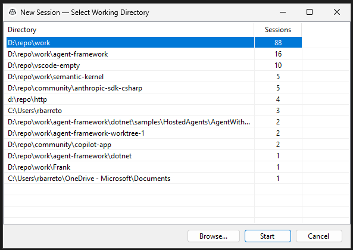

# Copilot App

> A Windows taskbar companion for GitHub Copilot CLI — manage sessions, tools, and IDEs from a single pinned icon.

**Copilot App** turns [GitHub Copilot CLI](https://docs.github.com/en/copilot/github-copilot-in-the-cli) into a first-class desktop experience. Pin it to your taskbar and get instant access to new sessions, session history, IDE integration, and per-user tool permissions — all without touching config files.

---

## ✨ Features at a Glance

### 📌 Taskbar Jump List

Right-click the pinned icon to access everything:

<p align="center">
  
</p>

- **New Copilot Session** — start a new session with a smart directory picker
- **Existing Sessions** — browse, resume, or open sessions in your IDE
- **Settings** — configure tools, directories, and IDEs

---

### 📂 Smart Directory Picker

When starting a new session, Copilot App shows your most-used working directories — sorted by frequency across all previous sessions. Non-existent paths are automatically cleaned up.

<p align="center">
  
</p>

No more typing paths. Just click and go — or hit **Browse...** to pick any folder.

---

### 🔄 Session Browser

Resume any previous session with full context. Each entry shows the session name, full working directory path, and last-used date.

<p align="center">
  
</p>

- **Open Session** — resumes the session in its original working directory
- **Open in IDE** — jump straight into the code (see below)
- **Refresh** — reload the session list without reopening the window

---

### 🖥️ IDE Integration

Open any session's working directory or git repository root in your configured IDE — with a single click.

<p align="center">
  
</p>

Each IDE shows two options:
- **Open CWD** — opens the session's exact working directory
- **Open Repo** — opens the git repository root (when different from CWD)

---

### ⚙️ Settings

All configuration lives in a tabbed UI — no JSON editing required.

#### Allowed Tools
Whitelist shell commands and MCP tools that Copilot can use without prompting:

<p align="center">
  
</p>

#### Allowed Directories
Grant Copilot access to specific directories:

<p align="center">
  
</p>

#### IDEs
Register your IDEs for the "Open in IDE" feature:

<p align="center">
  
</p>

---

## 🚀 Getting Started

### Prerequisites

- [.NET 8 SDK](https://dotnet.microsoft.com/download/dotnet/8.0) or later
- [GitHub Copilot CLI](https://docs.github.com/en/copilot/github-copilot-in-the-cli) — install via `winget install GitHub.Copilot` or `GitHub.Copilot.Prerelease`

### Install

```powershell
git clone <repo-url> copilot-app
cd copilot-app
.\install.ps1
```

### Pin to Taskbar

1. Run `CopilotApp.exe` from the publish folder
2. Right-click the icon in the taskbar → **Pin to taskbar**
3. Right-click the pinned icon → **Settings** to configure your tools and directories

### Manual Build

```powershell
cd src
dotnet publish -c Release -o ..\publish
```

---

## 💻 Command Line

```powershell
CopilotApp.exe                        # New session (shows CWD picker)
CopilotApp.exe "C:\my\project"        # New session in a specific directory
CopilotApp.exe --resume <sessionId>   # Resume a session in its original CWD
CopilotApp.exe --open-existing        # Open the session browser
CopilotApp.exe --open-ide <sessionId> # Open IDE picker for a session
CopilotApp.exe --settings             # Open settings
```

---

## 🏗️ Architecture

```
CopilotApp.exe (WinForms, hidden taskbar window)
├── Sets AppUserModelID for taskbar grouping
├── Registers PID → session mapping in ~/.copilot/active-pids.json
├── Launches copilot.exe with --allow-tool and --add-dir from settings
├── Detects new session via directory snapshot (before/after launch)
├── Updates jump list on launch + every 5 min (background, coordinated)
└── Cleans up on exit (unregisters PID, refreshes jump list)
```

### Files

| Path | Purpose |
|------|---------|
| `~/.copilot/launcher-settings.json` | Tools, directories, IDEs, default work dir |
| `~/.copilot/active-pids.json` | PID → session ID mapping |
| `~/.copilot/jumplist-lastupdate.txt` | Update coordination timestamp |
| `~/.copilot/launcher.log` | Debug log |
| `~/.copilot/session-state/` | Session metadata (managed by Copilot CLI) |

---

## 📄 License

MIT
