# Copilot Booster

<p align="center">
  
</p>

> Run multiple Copilot agents in parallel. One taskbar icon to manage them all.

Modern AI-assisted development isn't one task at a time — it's **multiple Copilot agents running simultaneously** across different repos, branches, and contexts. But juggling terminals, IDEs, and browsers for each agent creates a context-switching tax that kills the productivity gains.

**Copilot Booster** eliminates that overhead. Pin it to your taskbar and get **complete isolation per session** — each Copilot agent gets its own terminal, IDE workspace, and browser instance, all tracked and instantly accessible from a single icon. No more hunting for the right window. No more losing context. Just click and focus.

<p align="center">
  <a href="../../releases/latest"></a>
</p>

<p align="center">
  <a href="../../releases/latest/download/CopilotBooster-Setup.exe">📦 <b>Download Installer</b></a> &nbsp;|&nbsp;
  <a href="../../releases/latest/download/CopilotBooster-win-x64.zip">📁 <b>Download Portable ZIP</b></a>
</p>

### Why Copilot Booster?

| Without Copilot Booster | With Copilot Booster |
|---|---|
| Alt-Tab through dozens of windows to find the right terminal | Click the session → focus the exact terminal, IDE, or browser |
| Manually track which agent is working on what | Live Running column shows Terminal, Copilot CLI, IDE, Edge, and Explorer status per session |
| One shared browser for all research | Isolated Edge workspaces per session — tabs saved and restored automatically |
| Context-switch between repos by cd-ing around | Git worktree workspaces give each agent its own branch and directory |
| Lose track of parallel agents after a restart | Window handles, terminals, and Edge tabs all persist across restarts |
| No idea when an agent finishes | 🔔 Bell notifications with popups when a session is ready |

---

## ✨ Features at a Glance

### 🔦 Spotlight

Press **Win+Alt+X** from anywhere to slide the Booster window up from the taskbar. Click away to dismiss — no window management needed.

<p align="center">
  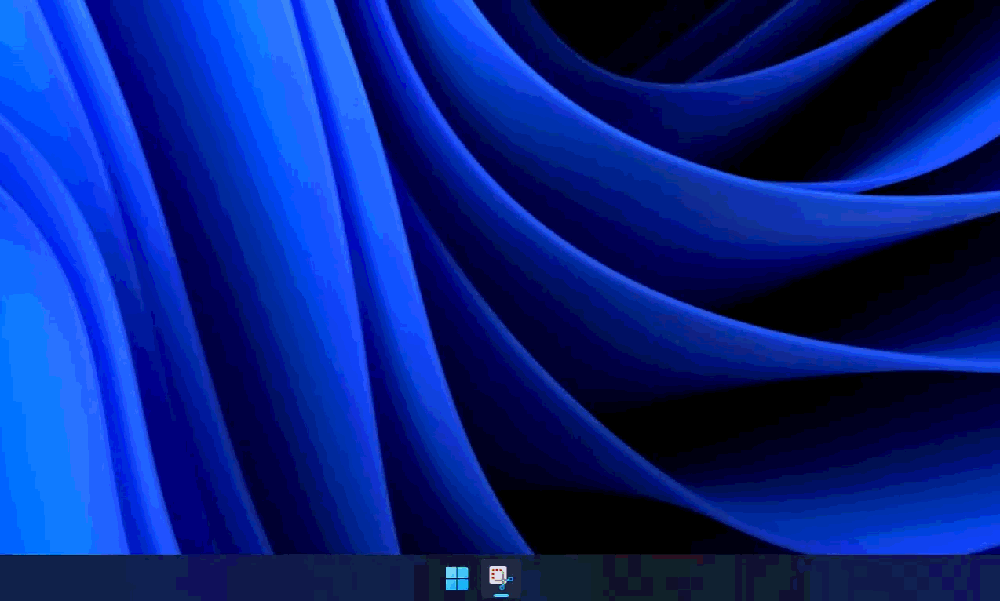
</p>

- **Global hotkey (Win+Alt+X)** — show/hide from anywhere, system-wide via Win32 `RegisterHotKey`
- **Slide animation** — smooth slide-up from the bottom of the screen (configurable)
- **Auto-hide on focus loss** — the window dismisses when you click elsewhere (stays visible for dialogs, context menus, and settings)
- **6 position options** — Bottom Left, Bottom Center, Bottom Right, Top Left, Top Center, Top Right
- **Per-monitor support** — choose which screen to show the spotlight on, or follow the cursor
- **Tray/taskbar activation** — clicking the tray icon or taskbar button shows the spotlight on the cursor's screen
- **Enabled by default** — spotlight mode is on out of the box; configure position and screen in Settings

---

### 📌 Taskbar Jump List

Right-click the pinned icon to access everything:

<p align="center">
  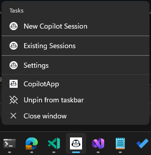
</p>

- **New Copilot Session** — start a new session with a smart directory picker
- **Existing Sessions** — browse, resume, or open sessions in your IDE
- **Settings** — configure tools, directories, and IDEs

---

### 🔄 Session Browser & Active Context Tracking

The session browser is the central hub. Each session shows **Session**, **CWD** (with ⎇ for Git repos), **Date**, **Running**, and **Ctx.** (context) columns — giving you a live view of what's running where. The **Ctx.** column displays file and Edge tab icons with counts, allowing quick access to session content. Sessions with active processes are automatically sorted to the top.

<p align="center">
  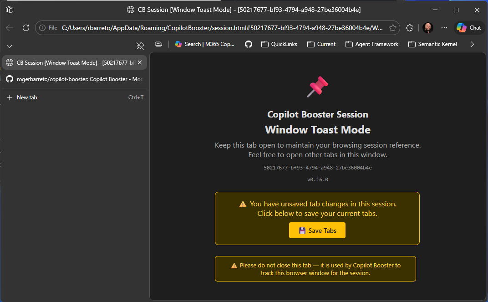
</p>

The **Running** column tracks running contexts across multiple environments:

| Context | How it's detected |
|---------|-------------------|
| **Terminal** | Windows launched via "Open Terminal" are tracked by PID and cached across restarts |
| **Copilot CLI** | Detected via `events.jsonl` content parsing — working (spinner) or idle (bell) |
| **Copilot Host** | The host process that owns each Copilot session (Windows Terminal, conhost, IDE shells) is tracked so click-to-focus lands on the right window — even pane-precise inside `wt.exe` |
| **IDE** | IDEs launched via the Open menu are tracked by window handle and cached across restarts |
| **Edge** | Browser workspaces tracked via UI Automation anchor-tab detection |
| **Explorer** | Explorer windows opened via context menu are tracked by HWND |
| **Files** | Session files folder opened via context menu |

Each active context is a **clickable link** — click to focus the corresponding window instantly. Re-opening an IDE that's already tracked for a session will focus the existing window instead of launching a new instance.

<p align="center">
  
</p>

#### 📑 Custom Session Tabs

Organize your sessions into custom tabs — up to 10 tabs with full drag-and-drop reordering. Add new tabs directly from the main window with the **+** button, or manage them in Settings.

<p align="center">
  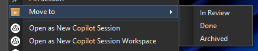
</p>

<p align="center">
  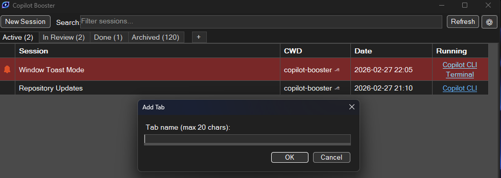
</p>

- **Quick add (+) button** — create new tabs directly from the session tab strip without opening Settings
- **Drag-and-drop columns** — reorder grid columns by dragging headers; column order is persisted across restarts (Status column stays pinned)
- **Drag-to-tab** — drag selected sessions onto a different tab header to move them between tabs
- **Move sessions between tabs** — right-click → "Move to" to reassign sessions to any tab

Other session browser features:
- **Multi-select** — hold Ctrl for individual selection or Shift for range selection; batch Pin/Unpin and Move to tab via context menu
- **Search** — filter sessions by title, folder, or metadata as you type
- **Pinned sessions** — pin sessions to keep them at the top regardless of sorting
- **Running-first sorting** — sessions with active processes automatically float to the top
- **Auto-select on tab switch** — switching tabs immediately selects the first row for quick navigation
- **Auto-refresh** — the list updates when new sessions appear or names change externally
- **Auto-cleanup** — empty sessions with no activity are automatically removed

---

### 🔔 Session Status & Notifications

The status column shows live session state with animated icons — a **spinning blue indicator** when Copilot CLI is working, and a **🔔 red bell** when it's idle and waiting for input. Bell rows are highlighted with a prominent red background for quick visual scanning.

<p align="center">
  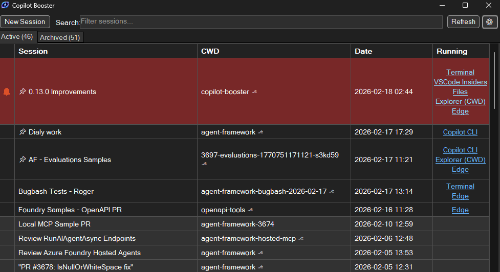
</p>

When a session finishes work, a **Windows notification** pops up with the session name. Status detection is powered by content-based parsing of `events.jsonl` — it understands assistant turns, tool requests, and `ask_user` pauses.

<p align="center">
  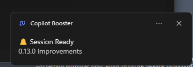
</p>

- **Content-based detection** — parses event types (assistant.turn_start, tool.execution_start, ask_user) for accurate status
- **One-shot notifications** — each bell only fires once per idle transition
- **Staleness threshold** — sessions inactive for 30+ minutes are ignored to prevent false bells
- **Startup-aware** — existing idle sessions don't trigger false notifications when the app launches
- **Persistent bell state** — bell notifications survive app restarts
- **Configurable** — toggle notifications on/off in Settings

---

### 📋 Right-Click Context Menu

Right-click any session row to access all actions in a single context menu with system icons:

<p align="center">
  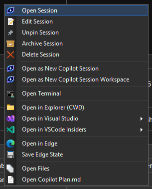
</p>

| Action | Description |
|--------|-------------|
| **Open Files** | Sub-menu listing session files (plan.md, files/ contents) with shell icons; top item opens session folder |
| **Open Session** | Resume the session in its original working directory |
| **Edit Session** | Rename the session or change its working directory |
| **Pin / Unpin** | Pin sessions to keep them at the top of the list |
| **Move to →** | Move sessions between configurable tabs |
| **Open as New Copilot Session** | Start a fresh Copilot CLI session in the same directory |
| **Open as New Copilot Session Workspace** | Create a Git worktree workspace (Git repos only) |
| **Open Terminal** | Launch a terminal via Windows Terminal (wt.exe) |
| **Open in Explorer (CWD)** | Open the working directory in Explorer |
| **Open in {IDE}** | Sub-menu with CWD/Repo Root folders + matched project files |
| **Open in Edge** | Launch a managed Edge browser workspace |
| **Save Edge State** | Manually save Edge tabs (visible when Edge is open) |
| **Delete Session** | Soft-delete a session (last item, separated) |

---

### 🔍 IDE File Pattern Matching

Configure file patterns per IDE (e.g., `*.sln;*.slnx`) in Settings. When a pattern is set, the IDE context menu becomes a **sub-menu** that searches for matching project files and shows them for quick one-click opening.

<p align="center">
  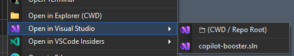
</p>

- **Fast search** — uses `git ls-files` for Git repos (respects .gitignore), falls back to directory walk with configurable ignored directories
- **Depth-sorted** — shallowest matches shown first, up to 5 results
- **Configurable exclusions** — manage ignored directories (node_modules, bin, obj, etc.) in the IDEs settings tab

<p align="center">
  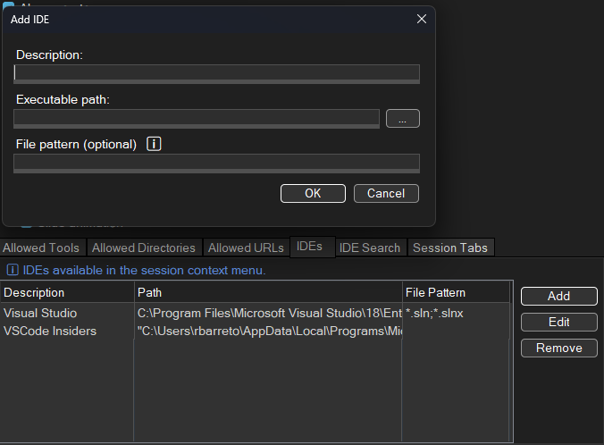
</p>

---

### 🌐 Edge Browser Workspaces

Open a managed Microsoft Edge window linked to any session. Each workspace gets a unique anchor tab that lets Copilot Booster track, focus, and detect whether the browser window is still open.

<p align="center">
  
</p>

- **Tab save/restore** — save Edge tabs via "Save Edge State" in the context menu; tabs are restored when reopening Edge for the session
- **Active tracking** — the Edge workspace appears as a clickable link in the Running column
- **Session name in tab** — the anchor tab title shows the session name; updates live when you change the alias
- **Manual save** — "Save Edge State" context menu button saves all open tabs for the session
- **Tab-level detection** — uses UI Automation to find the anchor tab across all Edge windows
- **Auto-cleanup** — when you close the anchor tab or the Edge window, the workspace is automatically removed from tracking

---

### 📂 Smart Directory Picker

The **New Session** dialog shows your most-used working directories — sorted by frequency across all previous sessions. Non-existent paths are automatically cleaned up.

<p align="center">
  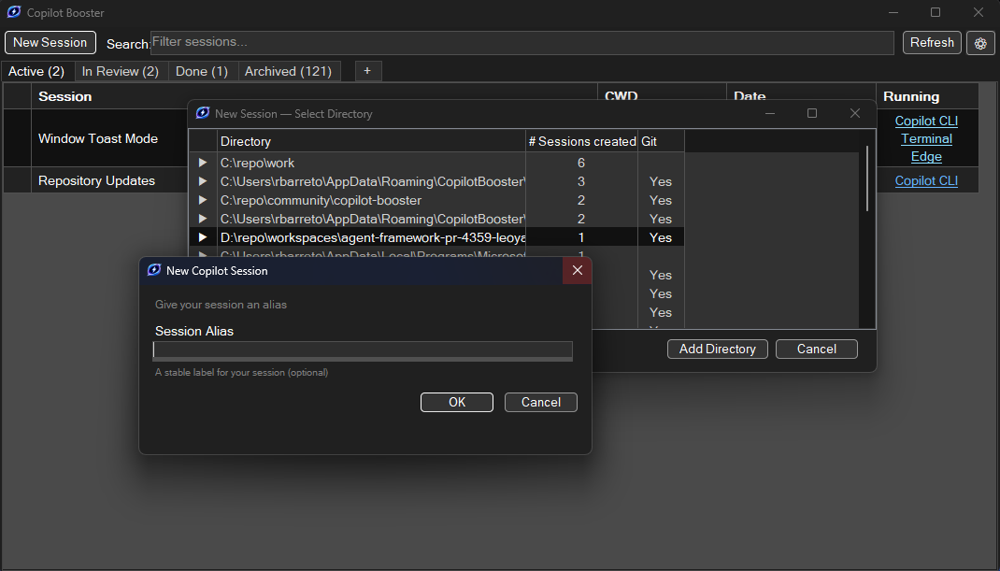
</p>

Each directory shows:
- **# Sessions created** — how many sessions have used this path
- **Git** — whether the directory is inside a Git repository (including worktrees)

Right-click any directory to access all actions, or double-click to quickly start a new session with a name prompt.

---

### 🌿 Git Workspace Creation

For Git-enabled directories, Copilot Booster can create isolated workspaces backed by [git worktrees](https://git-scm.com/docs/git-worktree). Each workspace gets its own branch and directory — perfect for working on multiple features in parallel without stashing or switching branches.

Create a workspace from two places:
- **New Session** → right-click a Git directory → **New Copilot Session Workspace**
- **Existing Sessions** → right-click a session → **Open as New Copilot Session Workspace**

Workspaces are stored by default in `%APPDATA%\CopilotBooster\Workspaces\` and named after the repository and branch (e.g., `myrepo-feature-xyz`). The workspace directory can be changed in Settings.

The workspace dialog offers three modes:

#### Existing Branch

Check out an existing branch into its own worktree. The branch dropdown lists all local and remote branches.

<p align="center">
  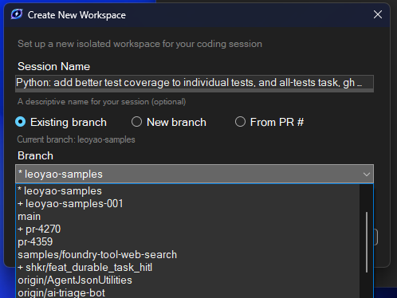
</p>

#### New Branch

Create a new branch based on any existing branch. Pick a base branch from the dropdown and name your new branch.

<p align="center">
  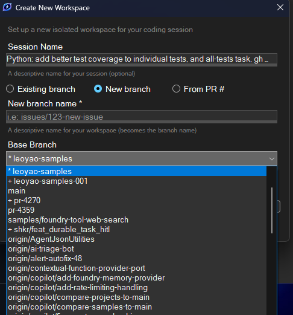
</p>

#### From PR #

Start a workspace directly from a GitHub PR number. Copilot Booster validates the PR and fetches its title, then checks out the contributor's original branch name — matching what `gh pr checkout` does.

<p align="center">
  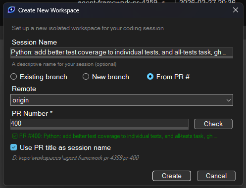
</p>

#### From Issue #

Start a workspace from a GitHub issue number. Enter the issue number, click **Check** to fetch the title, and optionally use it as the session name. Pick a base branch and Copilot Booster creates a new branch using the issue branch pattern configured in Settings (default: `issues/{number}-{alias}`).

<p align="center">
  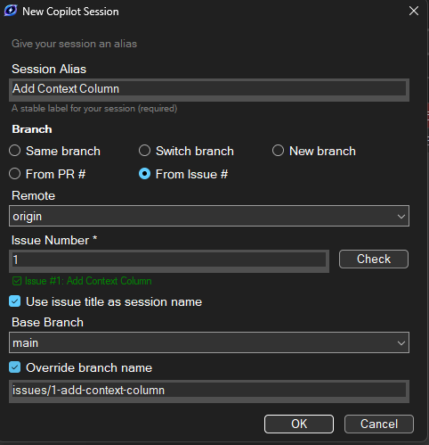
</p>

#### Update from Upstream First

When creating a workspace from an existing or new branch, you can optionally enable "Update from upstream first" to ensure the source branch is current before the worktree is created. This runs `git fetch` and fast-forwards the local branch to match its upstream remote, falling back to branching from the remote-tracking ref if the local branch is checked out elsewhere or has diverged. The option defaults to enabled and can be toggled in Settings under Git/GitHub. If the update fails, you are prompted to proceed anyway or cancel.

### AI auto-detect GitHub issue / PR

AI auto-detect reads the selected session conversation, extracts explicit GitHub issue and PR references, validates them with `gh`, then adds above-threshold candidates to the session's tracked GitHub items.

Use it from a session row: right-click → `GitHub` → `AI` → `Auto Detect GitHub Issue and PR`.

Settings live under Settings → AI:

| Field | Default | Range |
|-------|---------|-------|
| Enable AI auto-detect | On | On or off |
| Per-detection timeout | 300s | 30 to 1800 |
| Auto-apply confidence threshold | 0.5 | 0.0 to 1.0 |
| Model | (default — let Copilot decide) | Copilot models from API dropdown with offline cache |

**Path auto-resolution:** The Copilot CLI path is automatically resolved at runtime (no setting required). The resolver checks WinGet package locations first, then searches the system PATH, falling back to a bare `copilot.exe` lookup.

**Model dropdown:** The Model field is now a dropdown populated from the GitHub Copilot models API (`GET https://api.githubcopilot.com/models`), using your `gh` token for authentication. Models are cached locally for 24 hours at `%LOCALAPPDATA%\CopilotBooster\models-cache.json` — if the API is unreachable, cached models are used as a fallback. Text-embedding models are filtered out. The `(default — let Copilot decide)` option (saves as empty string) appears by default; if your saved model is not in the current list, it displays with a `(custom)` suffix.

Visual feedback appears in the GitHub column corner. A spinner means detection is running, and clicking it cancels after confirmation. A `?` icon means low confidence, and clicking it shows candidate details. A `!` icon means detection failed, and clicking it shows failure details.

Contributor note: the real `copilot -p` integration test is marked `[LocalOnlyFact]`, skipped on CI, and only runs locally with `COPILOT_BOOSTER_RUN_LOCALONLY=1`.

---

### ⚙️ Settings

All configuration lives in a tabbed UI with info labels and tooltips — no JSON editing required.

<p align="center">
  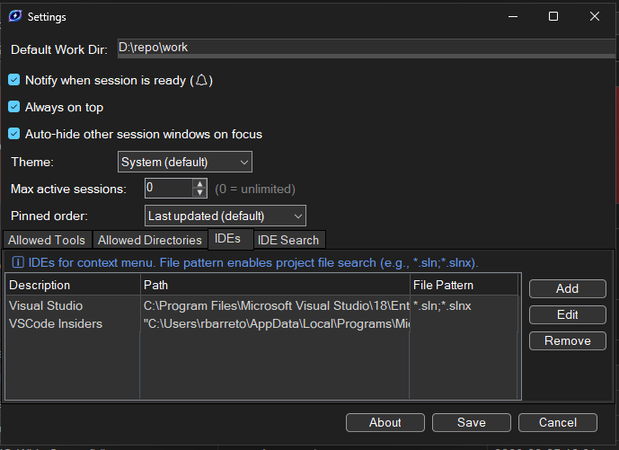
</p>

- **Theme** — choose between System (default), Light, or Dark theme; persisted across restarts
- **Date format** — choose between `YYYY-MM-DD HH:mm`, `MM/DD hh:mm AM/PM`, or `DD/MM HH:mm`; the Date column auto-sizes to fit
- **Notify on bell** — toggle Windows notifications when sessions finish work
- **Always on top** — keep the window above other windows
- **Auto-hide on focus** — hide other session windows when focusing one
- **Max active sessions** — configurable limit (0 = unlimited)
- **Pinned order** — sort pinned sessions by last updated or alias name
- **Default Work Dir** — set the default working directory for new sessions
- **Workspace Dir** — set the directory where Git worktree workspaces are stored (default: `%APPDATA%\CopilotBooster\Workspaces\`)
- **Spotlight** — enable/disable the spotlight feature and auto-hiding independently, configure position (6 options), target screen (per-monitor), and slide animation

<p align="center">
  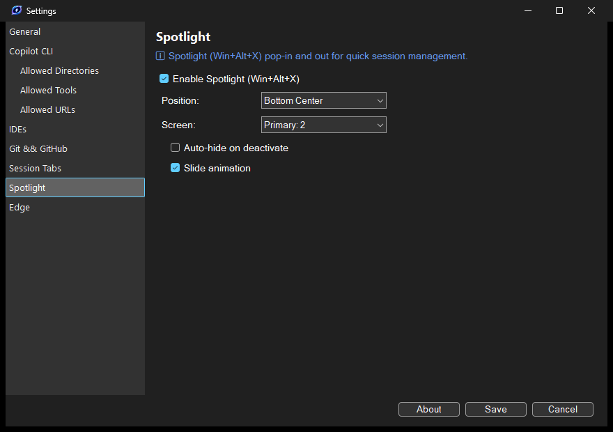
</p>

#### 🛠️ Allowed Tools

Whitelist shell commands and MCP tools that Copilot can use **without prompting for confirmation**. Each entry is passed as `--allow-tool` when launching the Copilot CLI, so matching commands execute immediately — no manual approval needed.

<p align="center">
  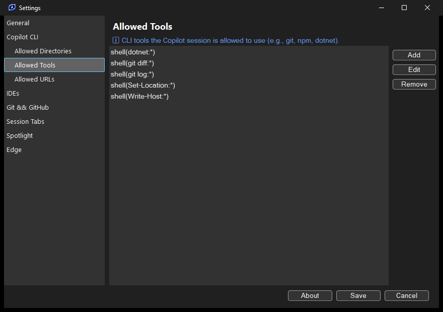
</p>

On first run, the list is empty. Here are some commonly used tools:

| Tool | Description |
|------|-------------|
| `shell(git log:*)` | Git log commands |
| `shell(git diff:*)` | Git diff commands |
| `shell(git status:*)` | Git status commands |
| `shell(Set-Location:*)` | Change directory in PowerShell |
| `mcp__github-mcp-server` | GitHub MCP server tools |

> **Tip:** Use wildcards (`*`) to allow all sub-commands under a prefix. For example, `shell(git log:*)` covers `git log`, `git log --oneline`, and any other git log variation.

#### 📁 Allowed Directories

Grant Copilot access to specific directories on your machine. Each entry is passed as `--add-dir` when launching the Copilot CLI, expanding the set of paths Copilot can read and write to.

<p align="center">
  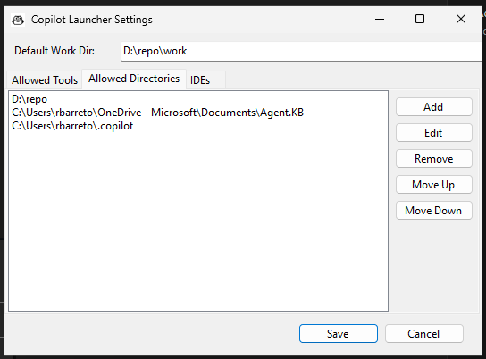
</p>

| Directory | Description |
|-----------|-------------|
| `D:\repo` | Your repository root |
| `~\.copilot` | Copilot session state |

> **Tip:** Add your top-level project folders so Copilot can navigate across repositories without being blocked by directory restrictions.

#### 🌐 Allowed URLs

Whitelist URLs that Copilot CLI can access without prompting. These are stored in the Copilot CLI global config (`~/.copilot/config.json`) as `allowed_urls`.

<p align="center">
  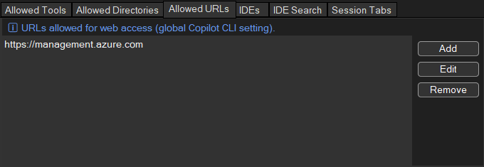
</p>

#### 💻 IDEs

Register your favorite IDEs — Visual Studio, VS Code, Rider, Eclipse, or any editor with a command-line launcher. Each IDE entry includes a description, executable path, and optional file pattern (e.g., `*.sln;*.slnx`) for automatic project file discovery in the context menu. The IDE Search section lets you manage directories excluded from file pattern search (e.g., `node_modules`, `bin`, `obj`).

<p align="center">
  
</p>

#### 📑 Session Tabs

Configure custom session tabs — add, rename, remove, and reorder tabs. The first tab is the default for new sessions.

<p align="center">
  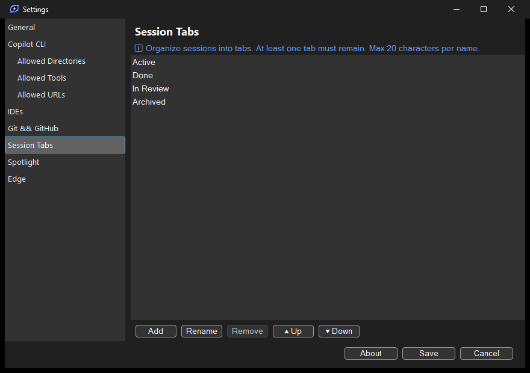
</p>

#### 🔀 Git & GitHub

Configure branch naming patterns for issue and PR-based workspaces. Use `{number}` and `{alias}` as placeholders.

<p align="center">
  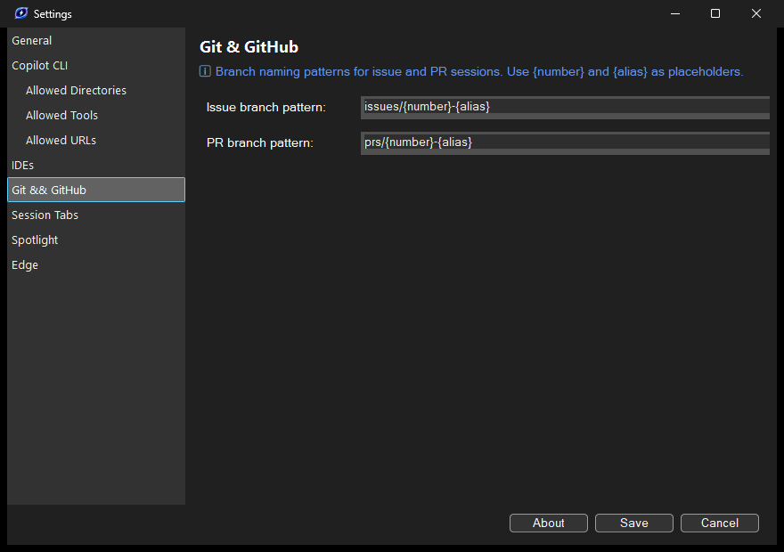
</p>

#### 🌐 Edge

Configure Microsoft Edge integration — toggle whether renaming a session automatically updates the Edge anchor tab title.

<p align="center">
  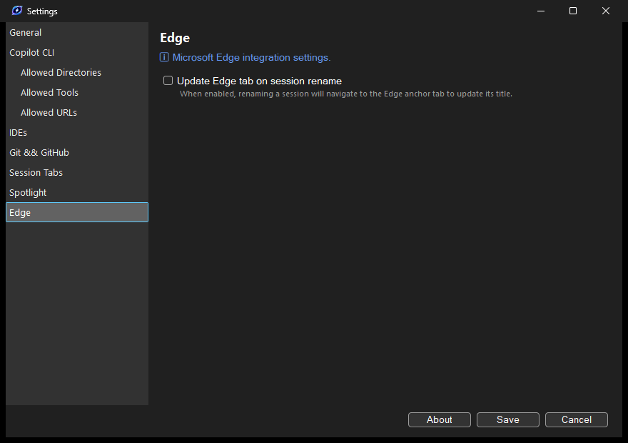
</p>

---

### 🔄 In-App Updates

Copilot Booster checks for new versions on startup by scanning the GitHub releases page. When an update is available, a banner appears at the bottom of the window — click to download and install the latest version automatically.

---

### 🔔 System Tray

Copilot Booster lives in your system tray for instant access. Closing the window minimizes to tray instead of exiting — only **Quit** from the tray menu exits the application.

<p align="center">
  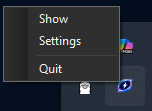
</p>

- **Double-click** the tray icon to show/restore the window
- **Right-click** for quick access to Show, Settings, or Quit
- The tray icon is always visible while the app is running

---

## 🚀 Getting Started

### Prerequisites

- [.NET 10 Runtime](https://dotnet.microsoft.com/download/dotnet/10.0) (or SDK for building from source)
- [GitHub Copilot CLI](https://docs.github.com/en/copilot/github-copilot-in-the-cli) — install via `winget install GitHub.Copilot` or `GitHub.Copilot.Prerelease`

### Install

#### Option A: Installer (Recommended)

Download **`CopilotBooster-Setup.exe`** from the [latest release](../../releases/latest) and run it.

- Installs to `%APPDATA%\CopilotBooster\` — no admin required
- Creates Start Menu and optional desktop shortcuts
- Includes uninstaller (Add/Remove Programs)

#### Option B: Portable EXE

Download **`CopilotBooster-win-x64.zip`** from the [latest release](../../releases/latest), extract it anywhere, and run `CopilotBooster.exe`.

#### Option C: Build from Source

```powershell
git clone <repo-url> copilot-booster
cd copilot-booster
.\install.ps1
```

### Pin to Taskbar

1. Run `CopilotBooster.exe` from the publish folder
2. Right-click the icon in the taskbar → **Pin to taskbar**
3. Right-click the pinned icon → **Settings** to configure your tools and directories

### Manual Build

```powershell
cd src
dotnet publish -c Release -o ..\publish
```

### Build Installer (requires [Inno Setup](https://jrsoftware.org/isdownload.php))

```powershell
dotnet publish src/CopilotBooster.csproj -c Release -o publish
iscc installer.iss
# Output: installer-output\CopilotBooster-Setup.exe
```

---

## 💻 Command Line

```powershell
CopilotBooster.exe                        # Open New Session tab
CopilotBooster.exe "C:\my\project"        # New session in a specific directory
CopilotBooster.exe --resume <sessionId>   # Resume a session in its original CWD
CopilotBooster.exe --open-existing        # Open the session browser
CopilotBooster.exe --open-ide <sessionId> # Open IDE picker for a session
CopilotBooster.exe --settings             # Open settings
```

---

## 🏗️ Architecture

```
CopilotBooster.exe (WinForms .NET 10, persistent taskbar window)
├── System tray icon (always visible, minimize-to-tray on close)
├── Sets AppUserModelID for taskbar/JumpList/notification association
├── Registers PID → session mapping in %APPDATA%\CopilotBooster\active-pids.json
├── Launches copilot.exe with --allow-tool and --add-dir from settings
├── Creates session workspace.yaml + events.jsonl for new sessions
├── Active context tracking (Terminal, Copilot CLI, IDE, Edge, Explorer)
│   ├── PID registry + process scanning for terminals
│   ├── events.jsonl content parsing for Copilot CLI status (working/idle/bell)
│   ├── HWND tracking for IDE instances (persisted across restarts)
│   ├── UI Automation for Edge anchor-tab detection
│   └── HWND tracking for Explorer windows
├── Per-session state (Edge tabs, session-specific data)
├── IDE file pattern search (git ls-files / directory walk)
├── Window handle cache persistence (unified for all window types)
├── Terminal cache persistence across restarts
├── Updates jump list on launch + every 5 min (background, coordinated)
└── Cleans up on exit (unregisters PID, refreshes jump list)
```

### Key Services

| Service | Purpose |
|---------|---------|
| `ActiveStatusTracker` | Aggregates active status across all context types with HWND persistence |
| `EventsJournalService` | Content-based Copilot CLI status detection via events.jsonl parsing |
| `BellNotificationService` | Notifications and bell state management |
| `GlobalHotkeyService` | System-wide Win+Alt+X hotkey via Win32 `RegisterHotKey` |
| `SessionDataService` | Unified session loading with Git detection caching |
| `CopilotSessionCreatorService` | Creates new sessions with workspace.yaml and events.jsonl |
| `EdgeWorkspaceService` | Edge browser workspace lifecycle and UI Automation |
| `EdgeTabPersistenceService` | Save/restore Edge tabs per session |
| `IdeFileSearchService` | Fast project file search (git ls-files / directory walk) |
| `SessionStateService` | Per-session state directory management |
| `WindowHandleCacheService` | Unified window handle persistence across restarts |
| `TerminalCacheService` | Persists terminal sessions across app restarts |
| `WindowFocusService` | HWND-based window focusing with P/Invoke |
| `SessionService` | Session CRUD, search, and Git root detection |
| `SessionArchiveService` | Archive and pin state persistence |
| `CopilotLocator` | Finds the Copilot CLI executable |
| `CopilotConfigService` | Reads/writes Copilot CLI global config (allowed_urls, trusted_folders) |

### Files

| Path | Purpose |
|------|---------|
| `%APPDATA%\CopilotBooster\launcher-settings.json` | Tools, directories, IDEs, file patterns, ignored dirs |
| `%APPDATA%\CopilotBooster\active-pids.json` | PID → session ID mapping |
| `%APPDATA%\CopilotBooster\terminal-cache.json` | Cached terminal sessions for restart persistence |
| `%APPDATA%\CopilotBooster\window-handles.json` | Unified window handle cache (IDE, Explorer, Edge) |
| `%APPDATA%\CopilotBooster\session-states.json` | Archive and pin states per session |
| `%APPDATA%\CopilotBooster\sessions\{id}\` | Per-session state directory |
| `%APPDATA%\CopilotBooster\sessions\{id}\edge-tabs.json` | Saved Edge tab URLs |
| `%APPDATA%\CopilotBooster\jumplist-lastupdate.txt` | Update coordination timestamp |
| `%APPDATA%\CopilotBooster\launcher.log` | Debug log |
| `%APPDATA%\CopilotBooster\pinned-directories.json` | Manually-added directories for New Session |
| `~/.copilot/session-state/` | Session metadata (managed by Copilot CLI) |

---

## 📄 License

MIT
